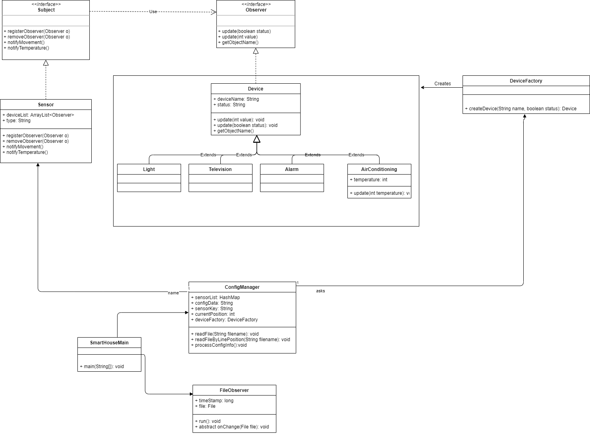

# TechGroup-SmartHome
###### **Descripción**

La casa inteligente esta compuesta de dispositivos electrónicos y sensores, donde los dispositivos de la
vivienda reaccionan de acuerdo a las señales enviadas por los sensores.
Se requiere contar con los siguientes puntos:
- La app se carga desde un archivo de configuración donde estará la información de los
dispositivos y sesiones.
- Cualquier cambio en este archivo será reflejado en la app, por ejemplo: Cambiar el estado de un
sensor para que notifique a sus dispositivos subscritos.
- Los dispositivos pueden ser desactivados para evitar recibir notificaciones.

###### **Class Diagram**

